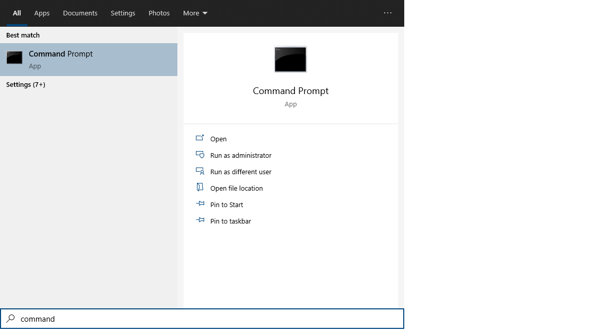
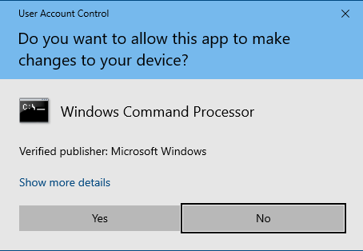
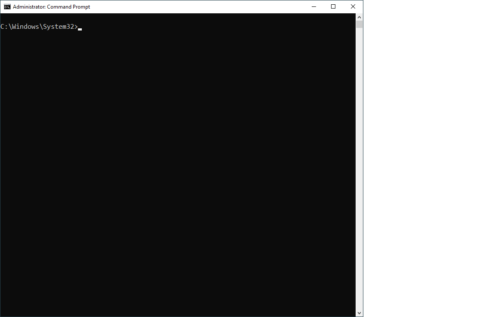
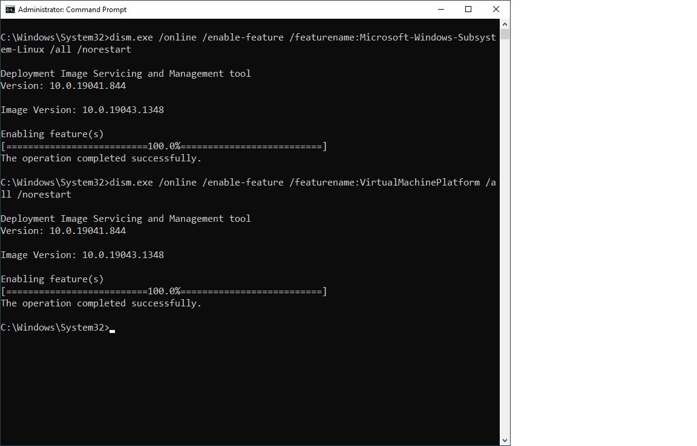
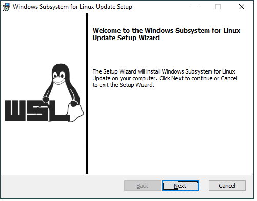
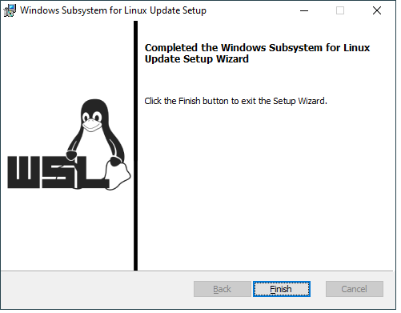

# Lighthouse Windows 10 WSL Setup !

## Summary

In this document we will walk through the installation and setup of the Lighthouse Labs WSL2 (Windows Subsystem for Linux) image.  We will perform the following steps:

1. Enable WSL on the computer 
2. Update the Kernel 
3. Download the LHL VM Image
4. Import the LHL VM image
5. Create some useful shortcuts

## 1.  Enable WSL on the computer 

For this step you will need to acesss a Windows Command Prompt in Administrator Mode.  

 **Type `command` into the Windows Search Bar.  You should see the following**

**Click on "Run as Administrator**
- If you see the following prompt, Click "Yes" to continue.

**You should see a Windows Command Terminal**
(the actual prompt may vary)

**Enter / paste the following 2 commands into the Terminal**

* `dism.exe /online /enable-feature /featurename:Microsoft-Windows-Subsystem-Linux /all /norestart`
* `dism.exe /online /enable-feature /featurename:VirtualMachinePlatform /all /norestart`

**Important!  Reboot your computer after this has completed**

## 2. Update the kernel package for WSL

**Download and open/install kernel update package here**

https://wslstorestorage.blob.core.windows.net/wslblob/wsl_update_x64.msi

If you forgot to reboot your computer in Step 1, you will see an error.  Reboot and try Step 2 again,

You should see this once the update has completed.

## 3. Download & extract the Lighthouse VM image

**Download this zip file:**

https://drive.google.com/file/d/1EdhF1pJ6HDIgyMihMNC1LgeQ3B4a6ApY

**Extract the "tar" file from within this zip file and save it to a place you can remember. (Its a big file!)**

## 4. Import the Lighthouse VM image into WSL

- **Open a Command Prompt terminal again**
- **Change to your home directory**: `cd %USERPROFILE%`
- **Create a folder for WSL Images**: `mkdir WSL_Images`
- **Set default WSL version**: `wsl --set-default-version 2`

### import the tar file you extracted in Step 3: 

`wsl --import LHL WSL_Images\LHL <tarfile>`

## LHL Image for WSL setup

Now that our setup is complete, we need to install the provided image for WSL

- Download archive : `https://lighthouse-labs-ca.s3-us-west-2.amazonaws.com/lhl-v1.1.exe`
- Extract the archive
- Open Powershell (as Admin)
- Create a folder in `AppData/Local` with the following command:
- Command: `cd $env:LOCALAPPDATA ; mkdir LHL`
- Import the WSL Image (considering you extracted the archive inside the Downloads folder):
- `wsl.exe --import LHL C:\Users\**YOU**\AppData\Local\LHL C:\Users\**YOU**\Downloads\LHLv1.1.tar --version 2`
- Close Powershell, voilà!

## Create a Windows Shortcut
- right click wherever you want to create the shortcut
- location of the item:  `wsl.exe -d LHL` -> Next
- Name for shortcut:  `Lighthouse VM` (or whatever you want)  -> finish
- Now you need to edit the properties: right click on new shortcut -> properties
- change the "start in" to `\\wsl$\LHL\home\labber\lighthouse`  -> OK

## How to start / use the LHL VM
- "Open"  (double click) on the shortcut you just created
- use the `ll` command, and you should  see your new empty lighthouse directory 

---

## Shortcuts & Useful knowledge
- Username is labber, password is labber
- Update the SSH Keys : https://web.compass.lighthouselabs.ca/activities/289 (You will need to create a .ssh folder in home)
- To open the file explorer in the current location: `$ e`
- To open VSCode in the current location: `$ code .`
- To open VSCode in a specific location: `$ code name_of_folder`
- To start the PostgreSQL server: `$ startpostgres`
- To stop WSL2 (In case of a problem, it auto shut down normally): `$ wslconfig.exe /t LHL`
- Make sure ESLint is installed: `$ npm install -g eslint`

## Windows Terminal setup (Optional)

- Install Windows Terminal with the following link : `https://aka.ms/terminal`
- For home folder, open preferences of windows terminal 
- Click on the LHL profile
- Update the starting directory value to: `//wsl$/LHL/home/labber/`

